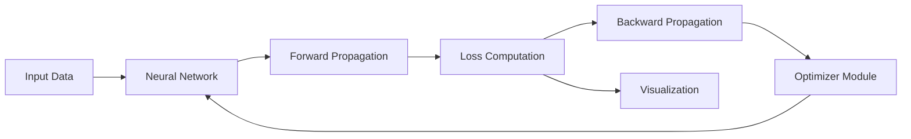
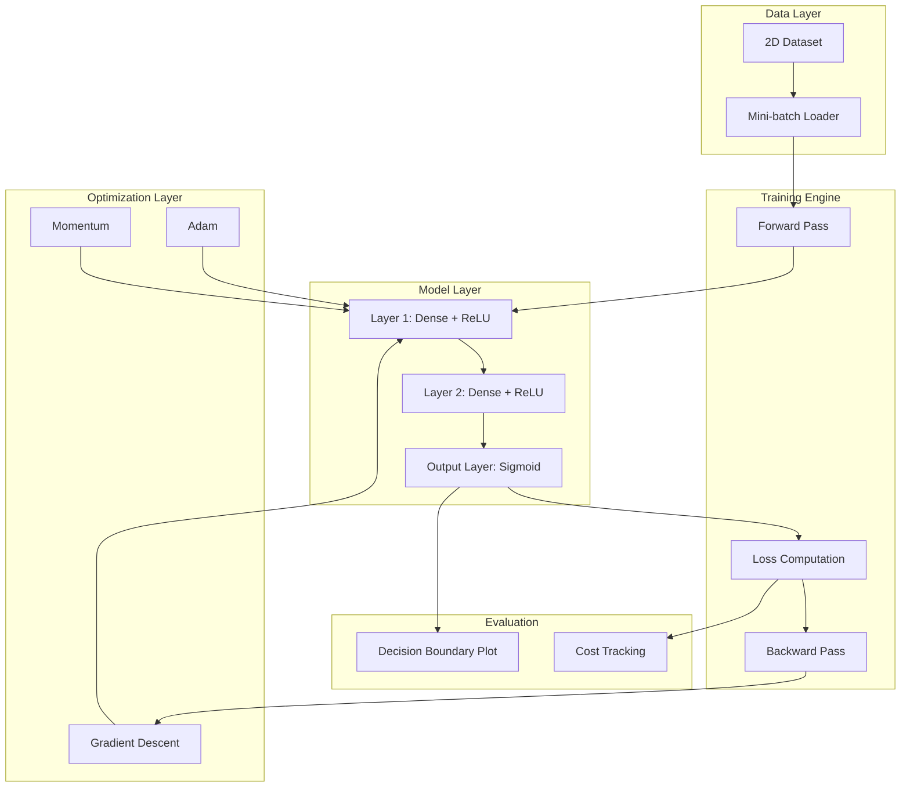

# Optimization Algorithms for Training Neural Networks

A hands-on deep learning project that implements and compares core optimization algorithms used to train neural networks. This project builds Gradient Descent, Momentum, and Adam optimizers from scratch to train a fully connected neural network on a 2D binary classification task using NumPy and Matplotlib.

---

## Overview

This repository focuses on understanding how optimization algorithms influence neural network training dynamics by implementing them from first principles. The system is designed to be modular, enabling easy experimentation and comparison across optimizers.

---

## Features

- From-scratch implementation of:
  - Gradient Descent
  - Momentum
  - Adam
- Mini-batch gradient descent training
- Forward and backward propagation from first principles
- Cost tracking across epochs
- Decision boundary visualization
- Modular optimizer selection framework

---

## Dataset

### 2D Synthetic Classification Dataset

**Description**  
Artificially generated 2D data points for binary classification. The dataset is designed to clearly visualize decision boundaries and optimizer behavior.

**Usage**  
- Loaded as NumPy arrays  
- Partitioned into mini-batches during training  

---

## System Architecture

### High-Level Pipeline

## Modular System Design

## Neural Network Architecture

| Layer          | Configuration            |
|----------------|--------------------------|
| Input Layer    | nₓ features              |
| Hidden Layer 1 | 5 neurons (ReLU)         |
| Hidden Layer 2 | 2 neurons (ReLU)         |
| Output Layer   | 1 neuron (Sigmoid)       |

- **Loss Function**: Binary Cross Entropy  
- **Optimizers**: Gradient Descent, Momentum, Adam  

---

## Optimization Algorithms

### Gradient Descent (GD)
- Standard parameter update rule  
- Serves as a baseline optimizer  

### Momentum
- Uses exponentially weighted moving averages of gradients  
- Reduces oscillations and accelerates convergence  

### Adam
- Combines Momentum and RMSProp  
- Applies bias correction  
- Adaptive learning rate per parameter  

---

## Training Pipeline

1. Mini-batch sampling  
2. Forward propagation  
3. Cost computation  
4. Backward propagation  
5. Parameter update using selected optimizer  
6. Cost tracking and visualization  

---

## Results and Visualization

- **Gradient Descent**: Stable but slower convergence  
- **Momentum**: Faster convergence with smoother updates  
- **Adam**: Most stable and adaptive optimizer  

Each optimizer generates:
- Cost vs Epoch plots  
- Decision boundary visualizations  
